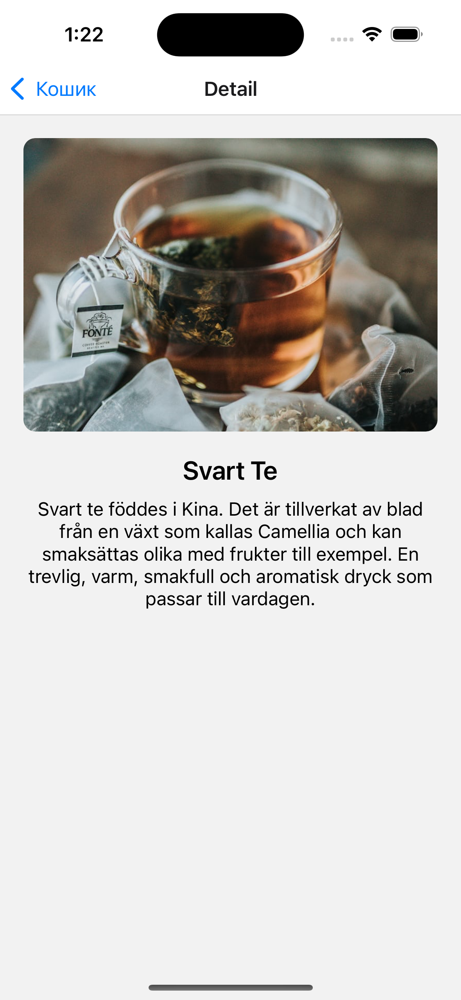
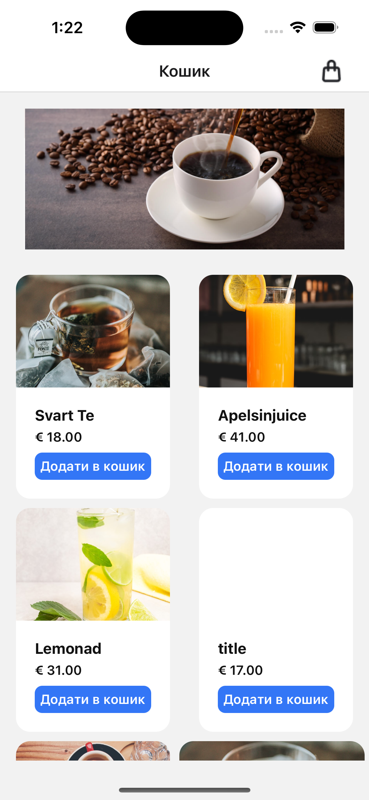
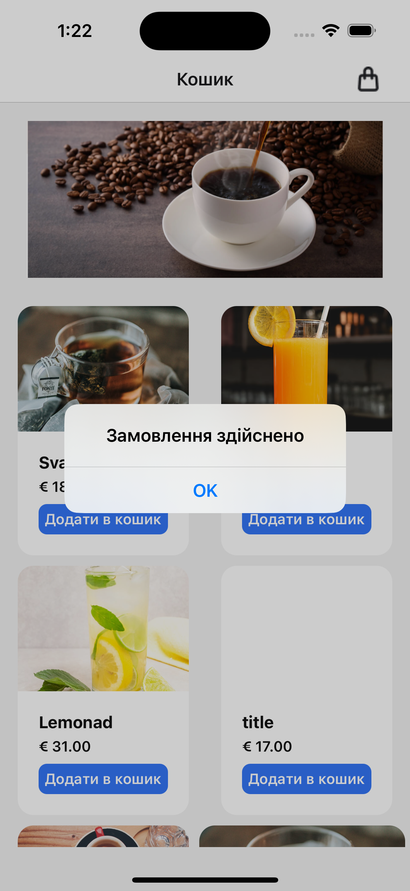

 Coffee Order App

Coffee Order App – це мінімалістичний мобільний додаток для швидкого замовлення кави. Основна ідея – дозволити користувачу оформити замовлення у три простих кроки.

Основні зміни та логіка рішень

Три ключові екрани:

Головний екран – вибір  кави.

Деталі замовлення – пергляд деталей.

Кошик – підтвердження та оформлення замовлення.

Мінімалістичний дизайн для швидкого та інтуїтивного користування.

Логіка побудована так, щоб користувач проходив шлях від вибору кави до оформлення замовлення без зайвих дій.

Ключові функції

Вибір кави на головному екрані.

Перегляд деталей замовлення.

Перегляд та підтвердження замовлення у кошику.

Скріншоти
  